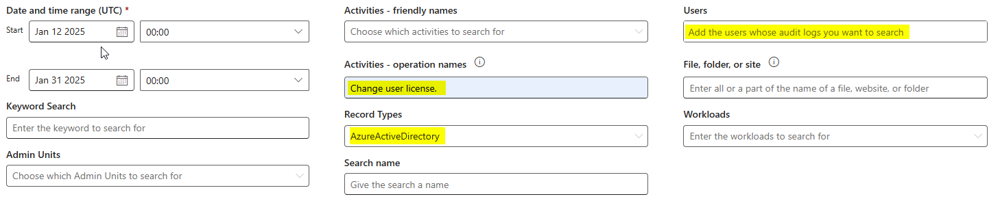

# Search User Administration Activities - Issues and Solutions

## Introduction 

In this article, I’ll share the challenges I ran into while searching for **User Administration Activities** i in Microsoft Purview, both with the graphical interface and PowerShell. :mag_right::computer:

After opening a support case with Microsoft and conducting extensive research, I was able to identify several key points and solutions that I believe will be helpful for administrators facing similar issues.

*Disclaimer: This article doesn’t dive into how to analyze the results or parse the CSV export from the Audit GUI.* :scissors:

## General Information

- [Audit Standard](https://learn.microsoft.com/en-us/purview/audit-solutions-overview#audit-standard)
    - Audit(Standard) is enabled by default for all organizations with appropriate subscriptions
    - 180-day audit log retention.

    >The default retention period for Audit (Standard) has changed from 90 days to 180 days. Audit (Standard) logs generated before October 17, 2023 are retained for 90 days. Audit (Standard) logs generated on or after October 17, 2023 follow the new default retention of 180 days.

## Use Case

Admins have encountered abnormal add-on and remove license activity on users, like 40 days ago. In order to understand, they asked me to find the source of these activities, who was behind them, when it happened, etc... 

We will take the case of a user to whom a Microsoft COPILOT license has been added and then removed at least 3 times.

***It is important to note that all processes are automated and that no administrator does these tasks by hand.***

## Technical Content

***We assume that you have:***
***-all necessary permissions and role to run audit logs search.***
***-appropriate subscription to use Audit Standard feature.***

We will first cover the search using PowerShell, then the search via the Purview Audit GUI

For both cases, several points should be kept in mind *(valid for both the graphical interface and PowerShell)*:

- When searching for actions performed by a specific user, we will scope the search to the user.

- When searching for actions performed by an admin or service on a user, you should not scope the search directly to the user. Instead, use a global scope, meaning do not specify anything in the "Users" field. *(Editor's note: Unless you know which administrator performed the actions, in which case you would scope the search to that administrator.)*

To refine the search, we will focus on the operations to search for and the RecordType these actions belong to.

-  The operations we are interested in are  [User Administration Activites](https://learn.microsoft.com/en-us/purview/audit-log-activities#user-administration-activities). Be carefull to use exactly the same name of the operation name.

>The operation names listed in the Operation column in the following table contain a period ( . ). You must include the period in the operation name if you specify the operation in a PowerShell command when searching the audit log, creating audit retention policies, creating alert policies, or creating activity alerts. Also be sure to use double quotation marks (" ") to contain the operation name.

- [RecordType](https://learn.microsoft.com/en-us/office/office-365-management-api/office-365-management-activity-api-schema#auditlogrecordtype) we will focus on is: AzureActiveDirectory.

We can now start the demonstration.

### PowerShell

I used the following commands :
`Search-UnifiedAuditLog -StartDate $startDate -EndDate $endDate -RecordType "AzureActiveDirectory" -Operations "change user license." -ResultSize 5000`

But no result. 
it's like audit was not enabled. I decided to check in Entra ID, for the same Operation, but in the last 30 days. Now I have some results. I'm sure that there is no problem with the logs, but in my request to get them.

After a MS Support Case, Microsoft gave me this information : (*No official sources of course*)

>The mentioned commands (search-UnifiedAuditsLog) are getting decrypted indeed, and will not be executable, and the alternative is to use Graph API, the Purview portal or the almost 10-year-old Search-UnifiedAuditLog cmdlet, while this cmdlet is available and age shouldn’t matter it is not suitable for bulk searches or extensive searches in large or busy tenants.

I tried running the same command again but with a smaller ResultSize.
`Search-UnifiedAuditLog -StartDate $startDate -EndDate $endDate -RecordType "AzureActiveDirectory" -Operations "change user license." -ResultSize 50`

**And finally, it worked!** :tada:

The Auditing feature product group recommands to use [Management Activity API reference](https://learn.microsoft.com/en-us/office/office-365-management-api/office-365-management-activity-api-reference) like described in [Search-UnifiedAuditLog (ExchangePowerShell) | Microsoft Learn](https://learn.microsoft.com/en-us/powershell/module/exchange/search-unifiedauditlog?view=exchange-ps#description)

>If you want to programmatically download data from the Microsoft 365 audit log, we recommend that you use the Microsoft 365 Management Activity API instead of using the Search-UnifiedAuditLog cmdlet in a PowerShell script. The Microsoft 365 Management Activity API is a REST web service that you can use to develop operations, security, and compliance monitoring solutions for your organization. For more information, see Management Activity API reference.

### Purview Audit GUI

Let's connect to Purview center and access to Audit feature.

- Select you're time range. (Up to 180 days)

- As we said above we are searching operations done on a user account, but whitout knowing who did it. So, we will scope on all Users.

- **Please**: Don't use the list *Activities - friendly names*. We are professionals after all. :military_medal:

- In Activities - Operation Name, use "Change user license." ([User Administration Activites](https://learn.microsoft.com/en-us/purview/audit-log-activities#user-administration-activities))
    - I don't know why, but it's impossible to use space character, so you must copy and paste the operation name in the field.

- In recordTypes : AzureActiveDirectory. [RecordTypes](https://learn.microsoft.com/en-us/office/office-365-management-api/office-365-management-activity-api-schema#auditlogrecordtype)

And start the research.

Now, I’ve got to parse and analyze a CSV that’s 71,405 KB big :cry:

## Conclusion

In conclusion, troubleshooting User Administration Activities in Microsoft Purview, especially when using the Search-UnifiedAuditLog cmdlet, can be challenging due to various limitations and performance issues when searching large logs. However, by adjusting search parameters (such as ResultSize), and following best practices like using the correct operation names and RecordTypes, you can significantly improve your search results.

Moreover, for large-scale or automated audits, it is advisable to explore the Microsoft 365 Management Activity API for better scalability and performance.

I hope this article helps other administrators avoid some of the obstacles I faced. By using these insights, you can better navigate the audit logs in Purview and gain deeper visibility into user activity.

Stay tuned for future articles where I will dive into analyzing audit results and parsing CSV exports for even more practical tips.
