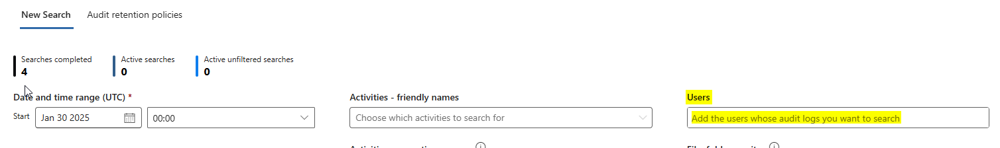

# Search-UnifiedAuditlogs Problems

## Introduction

Like many, I have been faced with an audit search problem on mailboxes. I finally found a solution by searching deeply into the web. 
 
In this post I will provide you with Microsoft's documentation, I have tested everything, and it finally works.  
 
I also have comments to Microsoft, directly to the product group (with a case Microsoft) but also by the technet article. 

## Technical Content
 
We assume that you have all necessary permissions and role to run audit logs search. 
 
**For Regular mailboxes:**  
 
if you have no results via GUI, It is possible that in the time interval there is no result. It may happen that the audit is blocked on the mailbox despite the fact that the feature is active. 
 
You may use the command Search-UnifiedAuditLog ([Search-UnifiedAuditLog documenation](https://learn.microsoft.com/fr-fr/powershell/module/exchange/search-unifiedauditlog?view=exchange-ps)) with the following parameters:  
 
* UsersIds : email address 
* Operations : event to be search [Exchange Mailbox Activites](https://learn.microsoft.com/en-us/purview/audit-log-activities#exchange-mailbox-activities) 
 
`Search-UnifiedAuditLog -UserIds <MailboxIdentity> -Operations MoveToDeletedItems, SoftDelete, HardDelete -StartDate "01/01/2025" -EndDate "15/01/2025"` 
 
Unfortunately, no results appear with powershell. [Here](https://learn.microsoft.com/en-us/purview/audit-troubleshooting-scenarios#search-for-mailbox-activities-performed-by-users-with-non-e5-licenses), you can find the documentation that describe the symptom and how to resolve it. 
 
>Even when [mailbox auditing on by default](https://learn.microsoft.com/en-us/purview/audit-mailboxes) is turned on for your organization, you might notice that mailbox audit events for some users aren't found in audit log searches by using the Microsoft Purview portal or the compliance portal, the **Search-UnifiedAuditLog** cmdlet, or the Office 365 Management Activity API. The reason for this is that mailbox audit events is returned only for users with E5 licenses when you use one of the previous methods to search the unified audit log. 
 
You must run the following command within Exchange Online :  
 
`Set-Mailbox -Identity <MailboxIdentity> -AuditEnabled $false` 
 
And then :  
 
`Set-Mailbox -Identity <MailboxIdentity> -AuditEnabled $true` 
 
Now you can search within the GUI or with powershell and you will have some results. 
   
**For Shared Mailboxes:** 
 
To search audit logs for a SharedMailbox, you must use the following command, with the parameter *FreeText.*  

`Search-UnifiedAuditLog -StartDate "08/01/2025" -EndDate "11/01/2025" -FreeText (Get-Mailbox -identity <MailboxIdentity>).ExchangeGuid -Operations MoveToDeletedItems`  
 
[Here](https://learn.microsoft.com/en-us/purview/audit-troubleshooting-scenarios#search-for-mailbox-activities-performed-in-a-specific-mailbox-including-shared-mailboxes), you can find the article that describes the FreeText parameters, and also decscribes that GUI is not working for SharedMailboxes. 
 
>Also, using the **User** dropdown list in the audit log search tool or the **Search-UnifiedAuditLog -UserIds** won't return results for activities performed in a shared mailbox. 
   
If there are no results and you are sure that there should be, then the same manipulation as described above will have to be done. Disable and then reactivate the audit on the mailbox:  
 
`Set-Mailbox -Identity <SharedMailboxIdentity> -AuditEnabled:$false` 
 
`Set-Mailbox -Identity <SharedMailboxIdentity> -AuditEnabled:$true` 
 
Run again the Search-UnifiedAuditLog command. Now you will find results. 

## Conclusion

I assume that the "Users" text box in the interface corresponds to the parameter "UserIds" in the commandlet. And there is no match for the "FreeText" parameter.

 
 
 
